# Introduction

AWS Amplify provides a Git-based workflow for creating, managing, integrating, and deploying serverless backends for web and mobile applications. The Amplify CLI provides a simple text-based user interface to provision and manage backend services, such as user authentication or a REST or GraphQL API for your applications. The Amplify Libraries allow to easily integrate these backend services with just a few lines of code in your applications.

In this module, we’ll begin by creating a new Android application to take travel notes. A note is made of a title, a description and a picture. We will enhance this application in the following modules.

This is a screenshot of the final application we are building in this tutorial.

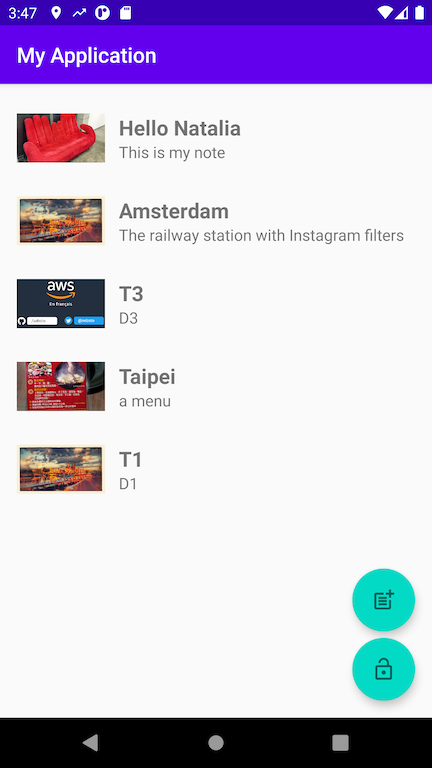

## What you Will Learn

- Create an Android application
- Update the main view to display a list of items
- Build and test your application

## Key Concepts

- [Kotlin](https://developer.android.com/kotlin) was chosen as the programming language for this tutorial because it allows you to reduce much of the boilerplate code and it is designed with type safety in mind.
- [Jetpack](https://developer.android.com/jetpack) - This tutorial uses Android's Jetpack, a collection of Android libraries that incorporate best practices and provide backwards compatibility in your Android apps.

# Implementation

## Create an Android Project

Start Android Studio and select **Start a new Android Studio project** from the splash screen:

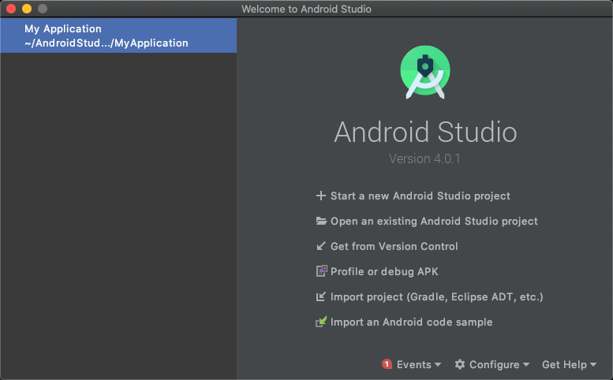

Under **Phone and Tablet**, select **Basic Activity** and click **Next**

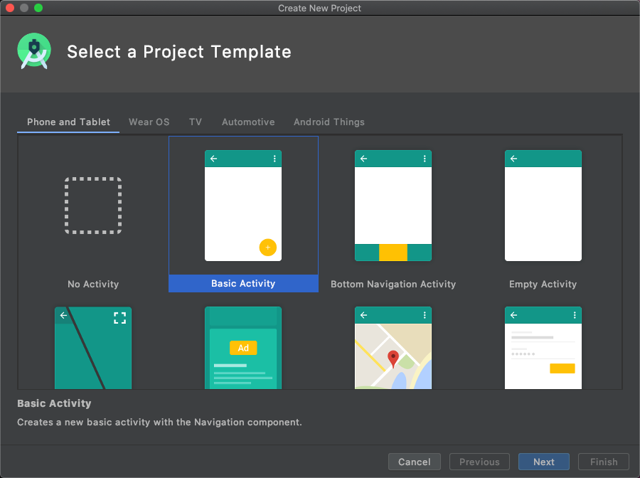

Type a name for your project, for example **Android Getting Started**.  Make sure Language is **Kotlin** and Minimum SDK is **API 26: Android 8.0 (oreo)**, then click **Finish**

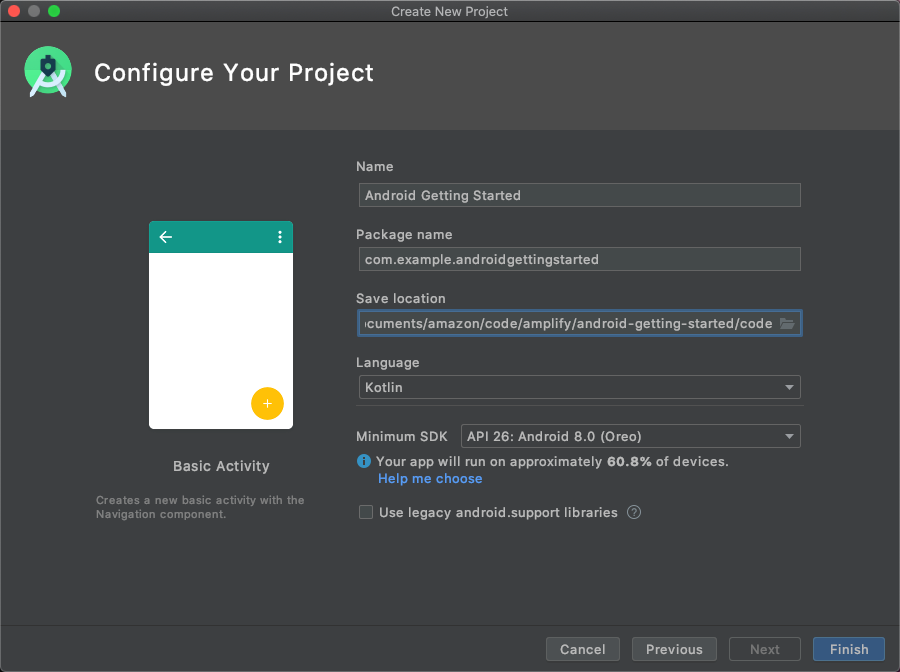

Now that the skeleton of the project exists, we need 4 steps to get our basic app running :

1. Delete unwanted classes and files
2. Create classes to hold our data structures 
3. Create a View to hold individual Note in the list 
4. Modify the `MainActivity` to display a list of Note 

## Delete the files we do not need

Under `res/layout` and `java/com.example.androidgettingstarted` delete the four `**fragment**` files (select the 4 files, right click and choose **Delete** from the contextual menu):

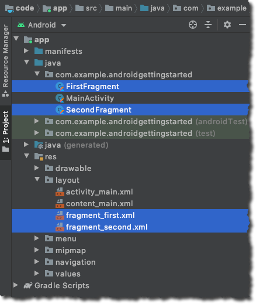

Under **Gradle Scripts**, open **build.gradle (Module:app)** and add the Kotlin Extension plugin.

```
plugins {
    id 'com.android.application'
    id 'kotlin-android'
    id 'kotlin-android-extensions' //  <== add this line
}
```

## Create a UserData data class

The `UserData` class holds the user state : a `isSignedIn` flag and a list of `Note` values.

To create a new class, right click `java/com.example/androidgettingstarted` and select **New** -> **Kotlin file/class**. Type **UserData** as name.

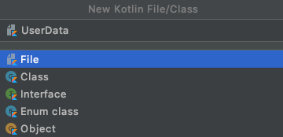

Paste the code below in the new file just created (`UserData.kt`)

```kotlin
package com.example.androidgettingstarted

import android.graphics.Bitmap
import android.util.Log
import androidx.lifecycle.LiveData
import androidx.lifecycle.MutableLiveData

// a singleton to hold user data (this is a ViewModel pattern, without inheriting from ViewModel)
object UserData {

    private const val TAG = "UserData"

    //
    // observable properties
    //

    // signed in status
    private val _isSignedIn = MutableLiveData<Boolean>(false)
    var isSignedIn: LiveData<Boolean> = _isSignedIn

    fun setSignedIn(newValue : Boolean) {
        // use postvalue() to make the assignation on the main (UI) thread
        _isSignedIn.postValue(newValue)
    }

    // the notes
    private val _notes = MutableLiveData<MutableList<Note>>(mutableListOf())

    // please check https://stackoverflow.com/questions/47941537/notify-observer-when-item-is-added-to-list-of-livedata
    private fun <T> MutableLiveData<T>.notifyObserver() {
        this.postValue(this.value)
    }
    fun notifyObserver() {
        this._notes.notifyObserver()
    }

    fun notes() : LiveData<MutableList<Note>>  = _notes
    fun addNote(n : Note) {
        val notes = _notes.value
        if (notes != null) {
            notes.add(n)
            _notes.notifyObserver()
        } else {
            Log.e(TAG, "addNote : note collection is null !!")
        }
    }
    fun deleteNote(at: Int) : Note?  {
        val note = _notes.value?.removeAt(at)
        _notes.notifyObserver()
        return note
    }

    fun resetNotes() {
        this._notes.value?.clear()  //used when signing out
        _notes.notifyObserver()
    }


    // a note data class
    data class Note(val id: String, val name: String, val description: String, var imageName: String? = null) {
        override fun toString(): String = name

        // bitmap image
        var image : Bitmap? = null

    }
}
```

### What did we just add ?

The `UserData` class is responsible to hold user data, namely a `isSignedIn` flag to track current authentication status and a list of `Note` objects. 

These two properties are implemented according to the `LiveData` publish / subscribe framework. It allows the Graphical User Interface (GUI) to subscribe to changes and to react accordingly. To learn more about `LiveData`, you can read [this doc](https://developer.android.com/topic/libraries/architecture/livedata) or follow [this short video tutorial](https://www.youtube.com/watch?v=OMcDk2_4LSk). To follow best practice, I keep the `MutableLiveData` property private and only expose the readonly `LiveData` property. Some [additional boilerplate code](https://stackoverflow.com/a/52075248/663360) is required when the data to publish is a list, as I want to make sure observers are notified when individual components in the list are modified.

We also added a `Note` [data class](https://kotlinlang.org/docs/reference/data-classes.html), just to hold the data of individual notes. I used two distinct properties for `ImageName` and `Image`. I will take care of `Image` later on in section [6 Add Storage](06_add_storage.md)

I choose to implement the [singleton design pattern](https://en.wikipedia.org/wiki/Singleton_pattern) for the `UserData` object, it allows me to refer to it from anywhere in the application just with `UserData`.

## Add GUI for individual cells in the list

An individual cell in a scrolling list is a [RecyclerView](https://developer.android.com/guide/topics/ui/layout/recyclerview), as the underlying View can be recycled when the user scrolls up and down, when the view is not visible on the screen anymore. 

Just like for a regular View, we create a layout XML files and a Kotlin class. A individual cell looks like this:

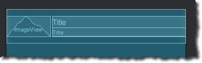

To create the layout file, right click `res/layout` and select **New** -> **Layout Resource File**. Type  **content_note** as name and leave all the other values, as we will directly edit the XML file.

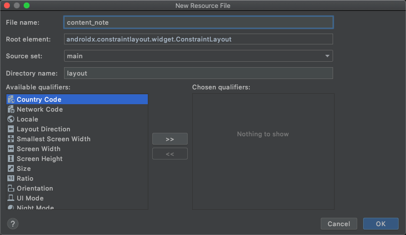

Open the **Code** view for the newly created file.

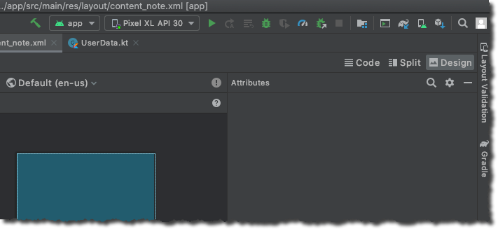

In the Code view of the new file just created (`content_note.xml`), replace the code generated by pasting the code below:

```xml
<?xml version="1.0" encoding="utf-8"?>
<LinearLayout xmlns:android="http://schemas.android.com/apk/res/android"
    android:layout_width="match_parent"
    android:layout_height="wrap_content"
    android:orientation="horizontal"
    android:paddingVertical="16dp">

    <ImageView
        android:id="@+id/image"
        android:layout_width="100dp"
        android:layout_height="match_parent"
        android:padding="8dp"
        android:scaleType="centerCrop"
        android:src="@drawable/ic_launcher_background" />

    <LinearLayout
        android:layout_width="match_parent"
        android:layout_height="wrap_content"
        android:layout_gravity="center"
        android:layout_marginLeft="5dp"
        android:orientation="vertical">

        <TextView
            android:id="@+id/name"
            android:layout_width="match_parent"
            android:layout_height="wrap_content"
            android:text="Title"
            android:textSize="20sp"
            android:textStyle="bold" />

        <TextView
            android:id="@+id/description"
            android:layout_width="match_parent"
            android:layout_height="wrap_content"
            android:text="Title"
            android:textSize="15sp" />

    </LinearLayout>
</LinearLayout>
```

Finally, create the Kotlin class: right click `java/com.example/androidgettingstarted` and select **New** -> **Kotlin file/class**. Type **NoteRecyclerViewAdapter** as name.

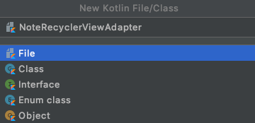

Paste the code below in the new file just created (`NoteRecyclerViewAdapter.kt`)

```kotlin
package com.example.androidgettingstarted

import android.view.LayoutInflater
import android.view.View
import android.view.ViewGroup
import android.widget.ImageView
import android.widget.TextView
import androidx.recyclerview.widget.RecyclerView

// this is a single cell (row) in the list of Notes
class NoteRecyclerViewAdapter(
    private val values: MutableList<UserData.Note>?) :
    RecyclerView.Adapter<NoteRecyclerViewAdapter.ViewHolder>() {

    override fun onCreateViewHolder(parent: ViewGroup, viewType: Int): ViewHolder {
        val view = LayoutInflater.from(parent.context)
            .inflate(R.layout.content_note, parent, false)
        return ViewHolder(view)
    }

    override fun onBindViewHolder(holder: ViewHolder, position: Int) {

        val item = values?.get(position)
        holder.nameView.text = item?.name
        holder.descriptionView.text = item?.description

        if (item?.image != null) {
            holder.imageView.setImageBitmap(item.image)
        }
    }

    override fun getItemCount() = values?.size ?: 0

    inner class ViewHolder(view: View) : RecyclerView.ViewHolder(view) {
        val imageView: ImageView = view.findViewById(R.id.image)
        val nameView: TextView = view.findViewById(R.id.name)
        val descriptionView: TextView = view.findViewById(R.id.description)
    }
}
```

### What did we just add?

The above code is made of 

- a layout xml file that describe the layout of component on a cell representing a `Note`. It displays the image, the note title, and the note description.

- a support Kotlin class. It receives a `Note` data object at creation time and assign individual values to their corresponding views (image, title and description)

## Update the Main Activity 

Now that we have the data classes (`UserData` and `Note`) and the individual note's view (`NoteRecyclerViewAdapter`), let's create the note list on the main activity.

From the file list on the left of Android Studio, open `res/layout/content_main.xml` and replace the code with this content:

```xml
<?xml version="1.0" encoding="utf-8"?>
<FrameLayout xmlns:android="http://schemas.android.com/apk/res/android"
    xmlns:app="http://schemas.android.com/apk/res-auto"
    xmlns:tools="http://schemas.android.com/tools"
    android:id="@+id/frameLayout"
    android:layout_width="match_parent"
    android:layout_height="match_parent"
    >

    <androidx.recyclerview.widget.RecyclerView
        android:id="@+id/item_list"
        android:name="com.example.myapplication.ItemListFragment"
        android:layout_width="match_parent"
        android:layout_height="match_parent"
        android:layout_marginTop="60dp"

        android:paddingHorizontal="8dp"
        android:paddingVertical="8dp"
        app:layoutManager="LinearLayoutManager"
        tools:context=".MainActivity"
        tools:listitem="@layout/content_note" />

</FrameLayout>
```
From the file list on the left of Android Studio, open `java/com.example/androidgettingstarted/MainActivity.kt` and replace the code with this content:

```kotlin
package com.example.androidgettingstarted

import android.os.Bundle
import android.util.Log
import androidx.appcompat.app.AppCompatActivity
import androidx.lifecycle.Observer
import androidx.recyclerview.widget.ItemTouchHelper
import androidx.recyclerview.widget.RecyclerView
import kotlinx.android.synthetic.main.activity_main.*
import kotlinx.android.synthetic.main.content_main.*

class MainActivity : AppCompatActivity() {

    override fun onCreate(savedInstanceState: Bundle?) {
        super.onCreate(savedInstanceState)
        setContentView(R.layout.activity_main)
        setSupportActionBar(toolbar)

        // prepare our List view and RecyclerView (cells)
        setupRecyclerView(item_list)
    }

    // recycler view is the list of cells
    private fun setupRecyclerView(recyclerView: RecyclerView) {

        // update individual cell when the Note data are modified
        UserData.notes().observe(this, Observer<MutableList<UserData.Note>> { notes ->
            Log.d(TAG, "Note observer received ${notes.size} notes")

            // let's create a RecyclerViewAdapter that manages the individual cells
            recyclerView.adapter = NoteRecyclerViewAdapter(notes)
        })
    }

    companion object {
        private const val TAG = "MainActivity"
    }
}
```

### What did we just add?

- the main layout is a [RecyclerView](https://developer.android.com/guide/topics/ui/layout/recyclerview) that manages the list of individual cells we created previously 

- the main activity class observes changes on the list of Notes and creates an `NoteRecyclerViewAdapter` to create individual cells.

## Verify the build dependencies

Under **Gradle Scripts**, open **build.gradle (Module:app)** and verify that the generated dependencies are correct.The `libraries versions` need to be checked.

```gradle
dependencies {
    implementation "org.jetbrains.kotlin:kotlin-stdlib:$kotlin_version"
    implementation 'androidx.core:core-ktx:1.3.2'
    implementation 'androidx.appcompat:appcompat:1.2.0'
    implementation 'com.google.android.material:material:1.2.1'
    implementation 'androidx.constraintlayout:constraintlayout:2.0.2'
    implementation 'androidx.navigation:navigation-fragment-ktx:2.3.1'
    implementation 'androidx.navigation:navigation-ui-ktx:2.3.1'
    testImplementation 'junit:junit:4.+'
    androidTestImplementation 'androidx.test.ext:junit:1.1.2'
    androidTestImplementation 'androidx.test.espresso:espresso-core:3.3.0'
}
```

## Build and Test

Now build and launch the app in the simulator. Click **Run** icon ▶️ in the toolbar or type **^ R**. 


After a while, the app starts in the Android Simulator, with an initial empty screen.

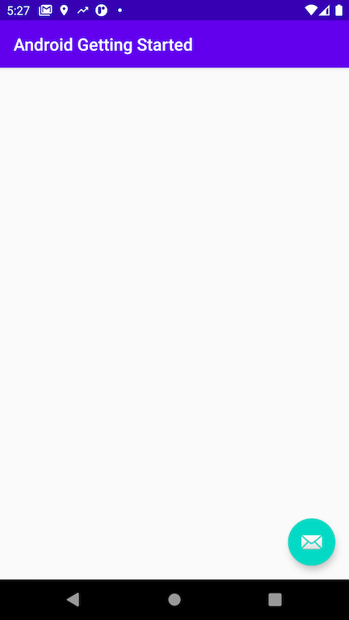

At this stage, there is no data to render at runtime. We will get rid of the mail icon in a later step.

You have successfully created an Android app. You are ready to start building with Amplify! 🎉

[Next](/03_initialize_amplify.md) : Initialize Amplify