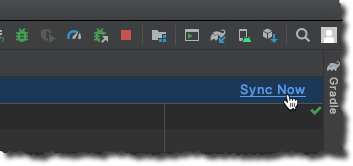
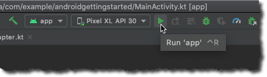

# Introduction

Now that we have created an Android application, we want to continue development and add new features.

To start to use AWS Amplify in your application, you must install the Amplify command line, initialize the amplify project directory, configure your project to use the Amplify libraries, and initialize Amplify Libraries at runtime.

## What you Will Learn

- Initialize a new Amplify project
- Add Amplify Libraries in your project
- Initialize Amplify libraries at runtime

## Key Concepts

- Amplify CLI - The Amplify CLI allows you to create, manage, and remove AWS services directly from your terminal.

- Amplify libraries – The Amplify libraries allow you to interact with AWS services from a web or mobile application.

# Implementation

## Install Amplify CLI

AWS Amplify CLI depends on [Node.js](https://nodejs.org/en/), refer to [the prerequisites section in the introduction](/01_introduction.md) to install Node.js.

To install AWS Amplify CLI, open a Terminal, and **type the following command**:

```zsh
## Install Amplify CLI
npm install -g @aws-amplify/cli

## Verify installation and version
amplify --version
# Scanning for plugins...
# Plugin scan successful
# 4.29.4
```

## Initialize an Amplify Backend

To create the basic structure of our backend, we first need to initialize the amplify project directory and to create our cloud backend.

Open a Terminal and change to the directory of your project. For example, if you created your project in the folder `~/AndroidStudioProjects/android-getting-started`, you can type:

```zsh
cd ~/AndroidStudioProjects/android-getting-started   
```

Verify you are in the correct directory, it should look like this:

```zsh
➜  android-getting-started git:(main) ✗ ls -al
total 32
drwxr-xr-x  14 stormacq  admin   448 Oct  6 14:06 .
drwxr-xr-x  16 stormacq  admin   512 Oct  6 11:28 ..
-rw-r--r--   1 stormacq  admin   208 Oct  6 14:04 .gitignore
drwxr-xr-x   6 stormacq  admin   192 Oct  6 14:04 .gradle
drwxr-xr-x  13 stormacq  admin   416 Oct  6 15:19 .idea
drwxr-xr-x   8 stormacq  admin   256 Oct  6 14:06 app
drwxr-xr-x   3 stormacq  admin    96 Oct  6 14:06 build
-rw-r--r--   1 stormacq  admin   642 Oct  6 14:04 build.gradle
drwxr-xr-x   3 stormacq  admin    96 Oct  6 14:04 gradle
-rw-r--r--   1 stormacq  admin  1162 Oct  6 14:04 gradle.properties
-rwxr--r--   1 stormacq  admin  5296 Oct  6 14:04 gradlew
-rw-r--r--   1 stormacq  admin  2260 Oct  6 14:04 gradlew.bat
-rw-r--r--   1 stormacq  admin   437 Oct  6 14:04 local.properties
-rw-r--r--   1 stormacq  admin    59 Oct  6 14:04 settings.gradle
```

Initialize the Amplify project structure and configuration file. **Execute the following command**:

```zsh
amplify init
```

- *? Enter a name for your project (androidgettingstarted)*: accept the default, press **enter**
- *? Enter a name for the environment (dev)*: accept the default, press **enter**
- *? Choose your default editor*: use the arrow key to select your favorite text editor an press **enter**
- *? Choose the type of app that you're building*: android is already selected, press **enter**
- *? Where is your Res directory*:  accept the default, press **enter**
- *? Do you want to use an AWS profile?*, Y, press **enter**
- *? Please choose the profile you want to use*: use the arrow keys to select your profile and press **enter**.

You can create a profile using AWS CLI using `aws configure --profile <name>` if you don't have one yet.

Amplify initializes your project in the cloud, it might take a few minutes. After a few minutes, you should see a message like:

```zsh
✔ Successfully created initial AWS cloud resources for deployments.
✔ Initialized provider successfully.
Initialized your environment successfully.

Your project has been successfully initialized and connected to the cloud!
```

## Add Amplify Libraries to your Project

Amplify for Android is distributed as Apache Maven packages. In this section, you’ll add the packages and other required directives to your build configuration.

Back to Android Studio, expand **Gradle Scripts** and open **build.gradle (Project: Android_Getting_Started)**. Add the line `mavenCentral()` within the `repositories` block in the `buildscript` and `allprojects` blocks.
```gradle
buildscript {
    ext.kotlin_version = "1.4.10"
    repositories {
        google()
        jcenter()

        // Add this line into `repositories` in `buildscript`
        mavenCentral()
    }
    dependencies {
        classpath "com.android.tools.build:gradle:4.0.1"
        classpath "org.jetbrains.kotlin:kotlin-gradle-plugin:$kotlin_version"

        // NOTE: Do not place your application dependencies here; they belong
        // in the individual module build.gradle files
    }
}

allprojects {
    repositories {
        google()
        jcenter()

        // Add this line into `repositories` in `buildscript`
        mavenCentral()
    }
}
```

Under **Gradle Scripts**, open **build.gradle (Module:app)** and add the Amplify framework core dependency in the `implementations` block.

```gradle
dependencies {
    implementation fileTree(dir: "libs", include: ["*.jar"])
    implementation "org.jetbrains.kotlin:kotlin-stdlib:$kotlin_version"
    implementation 'androidx.core:core-ktx:1.3.2'
    implementation 'androidx.appcompat:appcompat:1.2.0'
    implementation 'com.google.android.material:material:1.2.1'
    implementation 'androidx.constraintlayout:constraintlayout:2.0.1'
    implementation 'androidx.navigation:navigation-fragment-ktx:2.3.0'
    implementation 'androidx.navigation:navigation-ui-ktx:2.3.0'
    testImplementation 'junit:junit:4.13'
    androidTestImplementation 'androidx.test.ext:junit:1.1.2'
    androidTestImplementation 'androidx.test.espresso:espresso-core:3.3.0'

    // Amplify core dependency
    implementation 'com.amplifyframework:core:1.4.0'
}
```

Should you develop in Java or target Android SDK 21 or less, please [check the documentation](https://docs.amplify.aws/lib/project-setup/create-application/q/platform/android#n2-install-amplify-libraries) for additional configuration changes.

Now, run **Gradle Sync**.



After a while, you should see 

```text 
BUILD SUCCESSFUL in 1s
```

## Initialize Amplify at Runtime

Let's create a `Backend` class to group the code to interact with our backend. I use a [singleton design pattern](https://en.wikipedia.org/wiki/Singleton_pattern) to make it easily available through the application and to ensure the Amplify libraries are initialized only once.

The class initializer takes care of initializing the Amplify libraries.

Under `java/com.example.androidgettingstarted` create a new kotlin file `Backend.kt`, open it and add this code:

```kotlin
package com.example.androidgettingstarted

import android.content.Context
import android.util.Log
import com.amplifyframework.AmplifyException
import com.amplifyframework.core.Amplify

class Backend private constructor() {

    companion object  {
        private const val TAG = "Backend"
        var shared : Backend = Backend()
            private set
    }

    fun initialize(applicationContext: Context) : Backend {
        try {
            Amplify.configure(applicationContext)
            Log.i(TAG, "Initialized Amplify")
        } catch (e: AmplifyException) {
            Log.e(TAG, "Could not initialize Amplify", e)
        }
        return this
    }
}
```

We initialize our singleton `Backend` object when application launches.

Under `java/com.example.androidgettingstarted` create a new kotlin file `Application.kt`, open it and add this code:

```kotlin
package com.example.androidgettingstarted

import android.app.Application

class AndroidGettingStartedApplication : Application() {

    override fun onCreate() {
        super.onCreate()

        // initialize Amplify when application is starting
        Backend.shared.initialize(applicationContext)
    }
}
```

Under `manifests`, open `AndroidManifest.xml` and add the name of the application class to the `<application>` element.

```xml
    <!-- add the android:name attribute to the application node  -->
    <application
        android:name="AndroidGettingStartedApplication"
        android:allowBackup="true"
        android:icon="@mipmap/ic_launcher"
        android:label="@string/app_name"
        android:roundIcon="@mipmap/ic_launcher_round"
        android:supportsRtl="true"
        android:theme="@style/AppTheme">
...
```

While you have this file open, add a couple of permissions the application will require at later steps of this tutorial : 

```xml
    <!-- add these nodes between manifest and application  -->
    <uses-permission android:name="android.permission.INTERNET"/>
    <uses-permission android:name="android.permission.ACCESS_NETWORK_STATE"/>
    <uses-permission android:name="android.permission.READ_EXTERNAL_STORAGE"/>
```

## Verify your Setup

To verify everything works as expected, build and run the project.Click **Run** icon ▶️ in the toolbar or type **^ R**. 



There should be no error.

```text
BUILD SUCCESSFUL in 6s
23 actionable tasks: 8 executed, 15 up-to-date
```

[Next](/04_add_authentication.md) : Add user authentication.