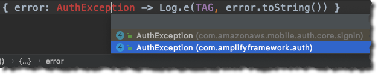
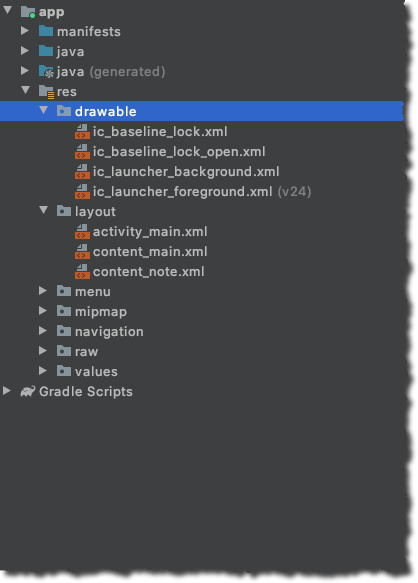
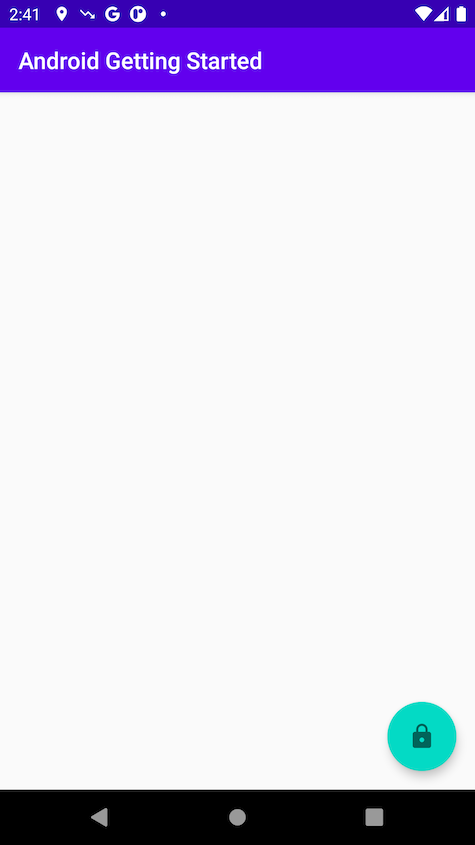
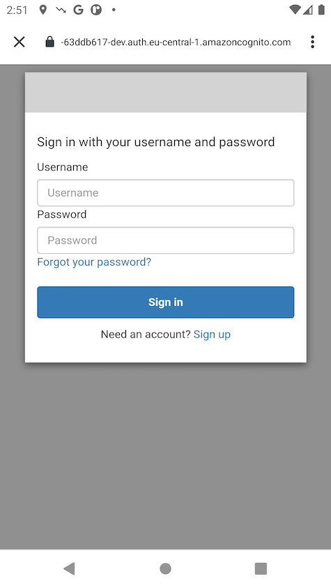
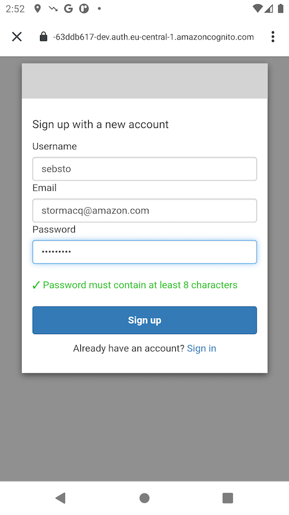
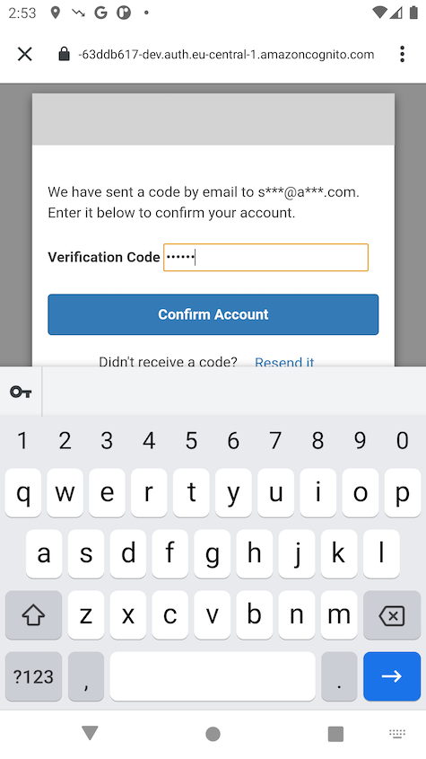

# Introduction

The next feature you will be adding is user authentication. In this module, you will learn how to authenticate a user with the Amplify CLI and libraries, leveraging [Amazon Cognito](https://aws.amazon.com/cognito/), a managed user identity provider.

You will also learn how to use the Cognito Hosted User Interface to present an entire user authentication flow, allowing users to sign up, sign in, and reset their password with just few lines of code.

Using a "Hosted User Interface" means the application leverages the Cognito web pages for the sign in and sign up user interface flows. The user of the app is redirected to a web page hosted by Cognito and redirected back to the app after sign in.  Of course, Cognito and Amplify does support native UI as well, you can follow [these workshop instructions](https://amplify-android-workshop.go-aws.com/70_add_custom_gui/30_customized_ui.html) to learn more about custom authentication UI.

## What you Will Learn

- Create and deploy an authentication service
- Configure your Android app to include Cognito Hosted UI authentication

## Key Concepts

- Amplify libraries – The Amplify libraries allow you to interact with AWS services from a web or mobile application.

- Authentication – In software, authentication is the process of verifying and managing the identity of a user using an authentication service or API.

# Implementation

## Create the Authentication Service

To create the authentication service, open a Terminal and **execute this command** in your project directory:

```zsh
amplify add auth
```

- *? Do you want to use the default authentication and security configuration?* Select **Default configuration with Social Provider** and press **enter**
- *How do you want users to be able to sign in?* Select the default **Username** and press **enter**
- *Do you want to configure advanced settings?* Select the default **No, I am done** and press **enter**
- *What domain name prefix do you want to use?* Select the default and press **enter**
- *Enter your redirect signin URI:* type **`gettingstarted://`** and press **enter**
- *? Do you want to add another redirect signin URI?* Select the default **N** and press **enter**
- *Enter your redirect signout URI:* type **`gettingstarted://`** and press **enter**
- *? Do you want to add another redirect signout URI?* Select the default **N** and press **enter**
- *Select the social providers you want to configure for your user pool:* do not select any provider and press **enter**

You know the configuration is successful when you see the message (the exact name of the resource will vary) :

```text
Successfully added resource androidgettingstartedfc5a4717 locally
```

## Deploy the Authentication Service

Now that the authentication service has been configured locally, you can deploy it to the cloud. In a Terminal, **execute this command** in your project directory:

```zsh
amplify push

# press Y when asked to continue
```

After a while, you should see the following message:

```zsh
✔ All resources are updated in the cloud

Hosted UI Endpoint: https://androidgettingstarted-dev.auth.eu-central-1.amazoncognito.com/
Test Your Hosted UI Endpoint: https://androidgettingstarted-dev.auth.eu-central-1.amazoncognito.com/login?response_type=code&client_id=1234567890&redirect_uri=gettingstarted://
```

## Add Amplify Authentication Library to the Project

Before going to the code, add the following dependency to your app‘s `build.gradle` along with others you added before and click **Sync Now** when prompted:

```gradle
dependencies {
    implementation 'com.amplifyframework:aws-auth-cognito:1.4.0'
}
```

## Configure Amplify Authentication library at runtime

Back to Android Studio, open `Backend.kt` file.  In the `Backend` class, **add a line** to the amplify initialization code we added in the previous section (in the `initialize()` method).

Complete code block should look like this:

```kotlin
// inside Backend class
fun initialize(applicationContext: Context) : Backend {
    try {
        Amplify.addPlugin(AWSCognitoAuthPlugin())
        Amplify.configure(applicationContext)

        Log.i(TAG, "Initialized Amplify")
    } catch (e: AmplifyException) {
        Log.e(TAG, "Could not initialize Amplify", e)
    }
    return this
}
```

Do not forget to add the import statements, Android Studio does that for you automatically (on Mac click on `Alt + Enter` on each error detected by the code editor).

To verify everything works as expected, build the project. Click **Build** menu and select **Make Project** or, on Macs, type **&#8984;F9**. There should be no error.

## Trigger Authentication at Runtime

The remaining code change tracks the status of user (are they signed in or not?) and triggers the SignIn / SignUp user interface user click on a lock icon.

1. Add `signIn` and `signOut` methods

    Anywhere in `Backend` class, add the following four methods:

    ```kotlin
   private fun updateUserData(withSignedInStatus : Boolean) {
        UserData.setSignedIn(withSignedInStatus)
    }

    fun signOut() {
        Log.i(TAG, "Initiate Signout Sequence")

        Amplify.Auth.signOut(
            { Log.i(TAG, "Signed out!") },
            { error -> Log.e(TAG, error.toString()) }
        )
    }

    fun signIn(callingActivity: Activity) {
        Log.i(TAG, "Initiate Signin Sequence")

        Amplify.Auth.signInWithWebUI(
            callingActivity,
            { result: AuthSignInResult ->  Log.i(TAG, result.toString()) },
            { error: AuthException -> Log.e(TAG, error.toString()) }
        )
    }
    ```

    Then add the required `import` statements for each missing class definiton (`Alt + Enter` on red words). When you have choice between multiple classes, be sure to select the one from the `amplify` package, as shown on the screenshot below.

    

    Notice that we do not update `UserData.isSignedIn` flag from these methods, this is done in the next section.


2. Add an authentication hub listener

    To track the changes of authentication status, we add code to subscribe to Authentication events sent by Amplify. We initialize the Hub in the `Backend.initialize()` method.

    When an authentication event is received, we call the `updateUserData()` method.  This method keeps the `UserData` object in sync.  The `UserData.isSignedIn` property is a `LiveData<Boolean>`, it means `Observers` that are subscribed to this property will be notified when the value changes. We use this mechanism to refresh the user interface automatically. You can [learn more about LiveData in the Android doc](https://developer.android.com/topic/libraries/architecture/livedata).

    We also add code to check previous authentication status at application startup time. When the application starts, it checks if a Cognito session already exists and updates the `UserData` accordingly.

    In `Backend.initialize()`, **add the following code** after the `try / catch` block and before the `return` statement.

    ```kotlin
    // in Backend.initialize() function, after the try/catch block but before the return statement 

    Log.i(TAG, "registering hub event")

    // listen to auth event
    Amplify.Hub.subscribe(HubChannel.AUTH) { hubEvent: HubEvent<*> ->

        when (hubEvent.name) {
            InitializationStatus.SUCCEEDED.toString() -> {
                Log.i(TAG, "Amplify successfully initialized")
            }
            InitializationStatus.FAILED.toString() -> {
                Log.i(TAG, "Amplify initialization failed")
            }
            else -> {
                when (AuthChannelEventName.valueOf(hubEvent.name)) {
                    AuthChannelEventName.SIGNED_IN -> {
                        updateUserData(true)
                        Log.i(TAG, "HUB : SIGNED_IN")
                    }
                    AuthChannelEventName.SIGNED_OUT -> {
                        updateUserData(false)
                        Log.i(TAG, "HUB : SIGNED_OUT")
                    }
                    else -> Log.i(TAG, """HUB EVENT:${hubEvent.name}""")
                }
            }
        }
    }

    Log.i(TAG, "retrieving session status")

    // is user already authenticated (from a previous execution) ?
    Amplify.Auth.fetchAuthSession(
        { result ->
            Log.i(TAG, result.toString())
            val cognitoAuthSession = result as AWSCognitoAuthSession
            // update UI
            this.updateUserData(cognitoAuthSession.isSignedIn)
            when (cognitoAuthSession.identityId.type) {
                AuthSessionResult.Type.SUCCESS ->  Log.i(TAG, "IdentityId: " + cognitoAuthSession.identityId.value)
                AuthSessionResult.Type.FAILURE -> Log.i(TAG, "IdentityId not present because: " + cognitoAuthSession.identityId.error.toString())
            }
        },
        { error -> Log.i(TAG, error.toString()) }
    )
    ```

    As in the previous step, add the required `import` statements for each missing class definiton (`Alt + Enter` on red words).

    To verify everything works as expected, build the project. Click **Build** menu and select **Make Project** or, on Macs, type **&#8984;F9**. There should be no error.

3. Update the User Interface code

    The last change in the code is related to the User Interface, we add a [FloatingActionButton](https://developer.android.com/reference/com/google/android/material/floatingactionbutton/FloatingActionButton) to the main activity. 

    Under `res/layout`, open `activity_main.xml` and **replace** the existing `FloatingActionButton` with this one:

    ```xml
    <com.google.android.material.floatingactionbutton.FloatingActionButton
        android:id="@+id/fabAuth"
        android:layout_width="wrap_content"
        android:layout_height="wrap_content"
        android:layout_alignParentRight="true"
        android:layout_gravity="bottom|end"
        android:layout_margin="@dimen/fab_margin"
        android:src="@drawable/ic_baseline_lock"
        app:fabCustomSize="60dp"
        app:fabSize="auto"
        />
    ```

    Add a lock icon under `res/drawable`. Right click `drawable`, select **New**, then **Vector Asset**. Chose the lock icon from the clipart and enter **ic_baseline_lock** (without the _24) as name. Click **Next** and **Finish**.

    Repeat the same with the open lock icon.

    
    

    After this, you should have the follwing files in your drawable directory:

    

    Now, link the newly created button in the code. Under `java/com.example.androidgettingstarted/`, open `MainActivity.kt` and add the following code.

    ```kotlin
    // anywhere in the MainActivity class
    private fun setupAuthButton(userData: UserData) {

        // register a click listener
        fabAuth.setOnClickListener { view ->

            val authButton = view as FloatingActionButton

            if (userData.isSignedIn.value!!) {
                authButton.setImageResource(R.drawable.ic_baseline_lock_open)
                Backend.signOut()
            } else {
                authButton.setImageResource(R.drawable.ic_baseline_lock_open)
                Backend.signIn(this)
            }
        }
    }
    ```

    Still in `MainActivity`, **add the following code** at the end of the `onCreate()` method:

    ```kotlin
    setupAuthButton(UserData)

    UserData.isSignedIn.observe(this, Observer<Boolean> { isSignedUp ->
        // update UI
        Log.i(TAG, "isSignedIn changed : $isSignedUp")

        if (isSignedUp) {
            fabAuth.setImageResource(R.drawable.ic_baseline_lock_open)
        } else {
            fabAuth.setImageResource(R.drawable.ic_baseline_lock)
        }
    })
    ```

    The above code register an `observer` on `Userdata.isSignedIn` value.  The closure is called when `isSignedIn` value changes. Right now, we just change the lock icon : open when the user is authenticated and closed when the user has no session.

    To verify everything works as expected, build the project. Click **Build** menu and select **Make Project** or, on Macs, type **&#8984;F9**. There should be no error.

4. Update `AndroidManifest.xml` and `MainActivity`

    Finally, we must ensure our app is launched at the end of the web authentication sequence, provided by Cognito hosted user interface.  We add a new `activity` in the manifest file. The activity is called when the `gettingstarted` URI scheme is received.

    In Android Studio, under `manifests`, open `AndroidManifest.xml` and add the below activity inside the `application` element.

    ```xml
    <activity
        android:name="com.amazonaws.mobileconnectors.cognitoauth.activities.CustomTabsRedirectActivity">
        <intent-filter>
            <action android:name="android.intent.action.VIEW" />

            <category android:name="android.intent.category.DEFAULT" />
            <category android:name="android.intent.category.BROWSABLE" />

            <data android:scheme="gettingstarted" />
        </intent-filter>
    </activity>
    ```

    Under `java/com.example.androidgettingstarted/`, open `MainActivity.kt` and add the following code anywhere in the class.

    ```kotlin
    // MainActivity.kt
    // receive the web redirect after authentication
    override fun onActivityResult(requestCode: Int, resultCode: Int, data: Intent?) {
        super.onActivityResult(requestCode, resultCode, data)
        Backend.handleWebUISignInResponse(requestCode, resultCode, data)
    }
    ```

    Under `java/com.example.androidgettingstarted/`, open `Backend.kt` and add the following code anywhere in the class.

    ```kotlin
    // Backend.kt
    // pass the data from web redirect to Amplify libs 
    fun handleWebUISignInResponse(requestCode: Int, resultCode: Int, data: Intent?) {
        Log.d(TAG, "received requestCode : $requestCode and resultCode : $resultCode")
        if (requestCode == AWSCognitoAuthPlugin.WEB_UI_SIGN_IN_ACTIVITY_CODE) {
            Amplify.Auth.handleWebUISignInResponse(data)
        }
    }
    ```

5. Build and Test

    To verify everything works as expected, build and run the project.Click **Run** icon ▶️ in the toolbar or type **^ R**.  There should be no error. The app starts and there is a closed lock floating button on the bottom right side of the screen.

Here is the full signup flow.

| Landing View (lock closed) | Cognito Hosted UI |
| --- | --- |
|  | 

| Signup flow | Verification Code | Main View (lock open) |
| --- | --- | --- |
|  |  | 

[Next](/05_add_api_database.md) : Add API & Database.