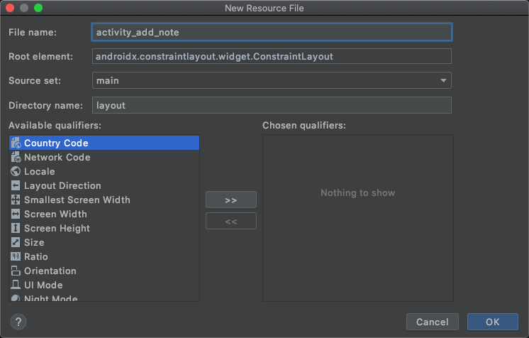
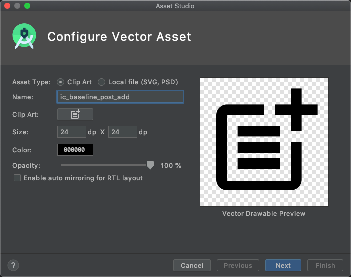
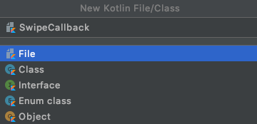
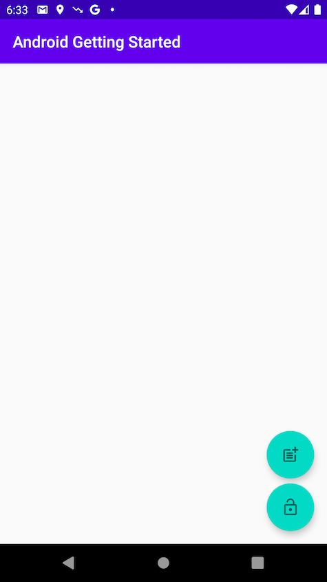
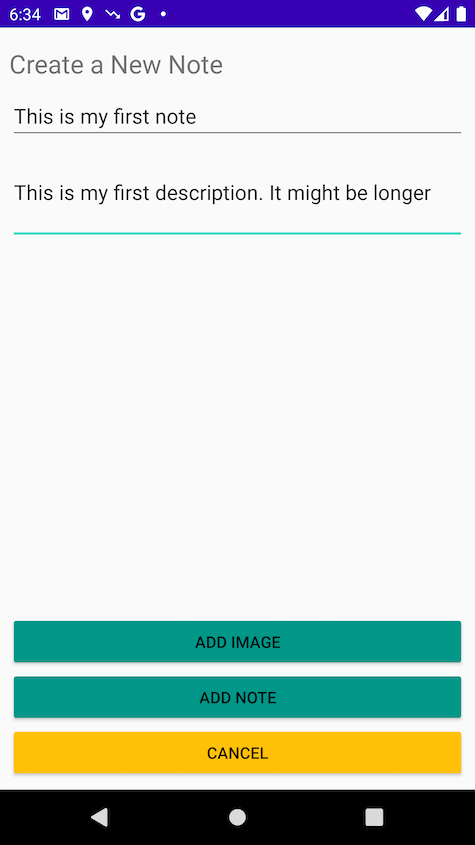
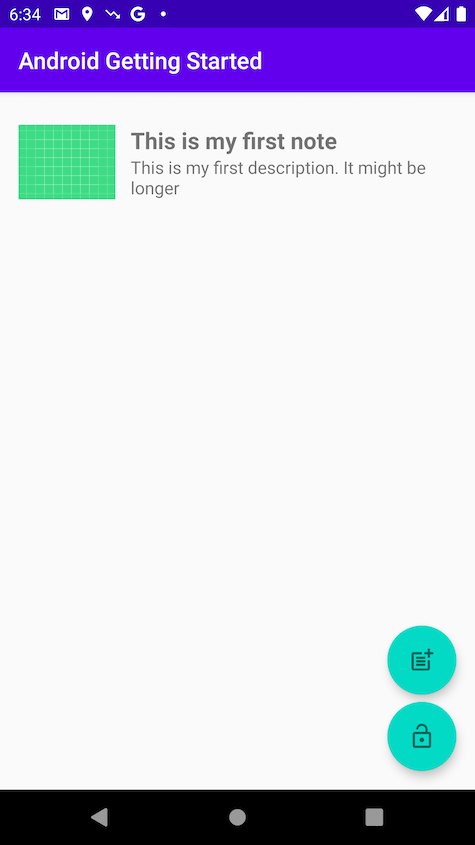
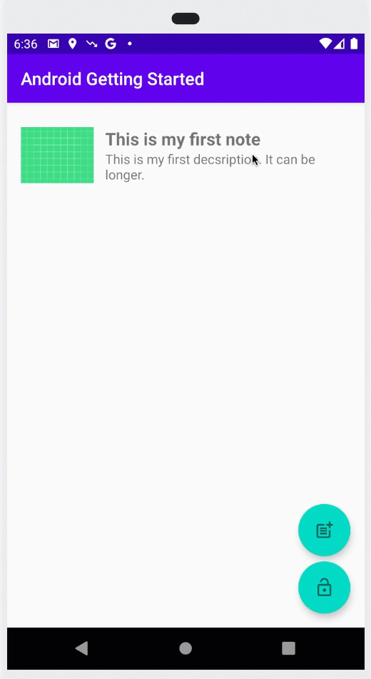

# Introduction

Now that we've created and configured the app with user authentication, let's add an API and Create, Read, Update, Delete (CRUD) operations on a database.

In this module, you will add an API to our app using the Amplify CLI and libraries. The API you will be creating is a [GraphQL](https://graphql.org) API that leverages [AWS AppSync](https://aws.amazon.com/appsync/) (a managed GraphQL service) which is backed by [Amazon DynamoDB](https://aws.amazon.com/dynamodb/) (a NoSQL database). For an introduction to GraphQL, [visit this page](https://graphql.org/learn/).

The app we will be building is a note taking app that allows users to create, delete, and list notes. This example gives you a good idea how to build many popular types of CRUD+L (create, read, update, delete, and list) applications.

## What You Will Learn

- Create and deploy a GraphQL API
- Write front-end code to interact with the API

## Key Concepts

**API** – Provides a programming interface that allows communication and interactions between multiple software intermediaries.

**GraphQL** – A query language and server-side API implementation based on a typed representation of your application. This API representation is declared using a schema based on the GraphQL type system. (To learn more about GraphQL, [visit this page](https://graphql.org/learn/).)

# Implementation

## Create a GraphQL API service and a Database  

To create the GraphQL API and its backing database, open a Terminal and **execute this command** from your project directory:

```zsh
amplify add api
```

- *? Please select from one of the below mentioned services:* : select **GraphQL** and press **enter**
- *? Provide API name:* select the default, press **enter**
- *? Choose the default authorization type for the API*: use the arrow key to select **Amazon Cognito User Pool** and press **enter**
- *? Do you want to configure advanced settings for the GraphQL API*: select the default **No, I am done** and press **enter**
- *? Do you have an annotated GraphQL schema?*, keep the default **N** and press **enter**
- *? What best describes your project*: choose any model, we are going to replace it with our own anyway. Press **enter**
- *? Do you want to edit the schema now?*, select *Y* and press **enter**

    The default text editor that you choose when you initialized the project (`amplify init`) opens with a prebuilt data schema.  

    **Delete** the schema and **replace it** with our app GraphQL schema:

    ```graphql
    type NoteData
    @model
    @auth (rules: [ { allow: owner } ]) {
        id: ID!
        name: String!
        description: String
        image: String
    }
    ```

    The data model is made of one class `NoteData` and 4 properties : `id` and `name` are mandatory. `description` and `image` are optional Strings.

    The `@model` transfomer indicates we want to create a database to store these data.

    The `@auth` transformer adds authentication rules to allow access to these data. For this project, we want only the owner of `NoteData`s to have access to them.

    Once done, do not forget to **save**, go back to your terminal to tell Amplify CLI you're done.

- *? Press enter to continue*, press **enter**.

After a few seconds, you should see a success message:

```text
GraphQL schema compiled successfully.
```

## Generate client side code

Based on the GraphQL data model definition we just created, Amplify generates client side code (i.e. Swift code) to represent the data in our app.

To generate the code, in your terminal, **execute the following command**:

```zsh
amplify codegen models
```

This creates Java files in `java/com/amplifyframework.datastore.generated.model` directory, as you can see with:

```zsh
➜  Android Getting Started git:(master) ✗ ls -al app/src/main/java/com/amplifyframework/datastore/generated/model 
total 24
drwxr-xr-x  4 stormacq  admin   128 Oct  7 15:27 .
drwxr-xr-x  3 stormacq  admin    96 Oct  7 15:27 ..
-rw-r--r--  1 stormacq  admin  1412 Oct  7 15:27 AmplifyModelProvider.java
-rw-r--r--  1 stormacq  admin  7153 Oct  7 15:27 NoteData.java
```

The files are automatically imported into your project.

## Deploy the API service and database

To deploy the backend API and database we have just created, go to your terminal and **execute the command**:

```zsh
amplify push

# press Y when asked to continue
```

- *? Are you sure you want to continue?* accept the default **Y** and press **enter**
- *? Do you want to generate code for your newly created GraphQL API* **type N** and press **enter**

After a few minutes, you should see a success message:

```text
✔ All resources are updated in the cloud

GraphQL endpoint: https://yourid.appsync-api.eu-central-1.amazonaws.com/graphql
```

## Add API client library to the Android Studio project

Before going to the code, back to Android Studio, add the following dependency to your app‘s `build.gradle` along with others you added before and click **Sync Now** when prompted:

```gradle
dependencies {
    implementation 'com.amplifyframework:aws-api:1.4.0'
}
```

## Initialize Amplify Libs at Runtime

Open `Backend.kt` and add a line in the Amplify initialization sequence in `initialize()` method. Complete try/catch block should look like this:

```kotlin
try {
    Amplify.addPlugin(AWSCognitoAuthPlugin())
    Amplify.addPlugin(AWSApiPlugin())
    Amplify.configure(applicationContext)

    Log.i(TAG, "Initialized Amplify")
} catch (e: AmplifyException) {
    Log.e(TAG, "Could not initialize Amplify", e)
}
```

## Add bridging between GraphQL data model and app model

Our project already has a data model to represent a `Note`. So I made a design decision to continue to use that model and provide for an easy way to convert a `NoteData` to a `Note`.
Open `UserData.kt` and add two components : a dynamic property that returns a `NoteData` object from a `UserData.Note`, and the opposite : a static method that accepts an API `NoteData` and return a `Userdata.Note`.

Inside the data class `Note`, add the following:

```kotlin
// return an API NoteData from this Note object
val data : NoteData
    get() = NoteData.builder()
            .name(this.name)
            .description(this.description)
            .image(this.imageName)
            .id(this.id)
            .build()

// static function to create a Note from a NoteData API object
companion object {
    fun from(noteData : NoteData) : Note {
        val result = Note(noteData.id, noteData.name, noteData.description, noteData.image)
        // some additional code will come here later
        return result
    }
}            
```

Be sure to import the `NoteData` class from the generated code.

## Add API CRUD Methods to the `Backend` Class

Let's add 3 methods to call our API: a method to query the Note, a method to create a new Note, and a method to delete a Note. Notice that these method works on the app data model (`Note`) to make it easy to interact from the User Interface. These method transparently convert `Note` to GraphQL's `NoteData` objects.

**Open** the `Backend.kt` file and **add the following** snippet at the end of the `Backend` class:

```kotlin
fun queryNotes() {
    Log.i(TAG, "Querying notes")

    Amplify.API.query(
        ModelQuery.list(NoteData::class.java),
        { response ->
            Log.i(TAG, "Queried")
            for (noteData in response.data) {
                Log.i(TAG, noteData.name)
                // TODO should add all the notes at once instead of one by one (each add triggers a UI refresh)
                UserData.shared.addNote(UserData.Note.from(noteData))
            }
        },
        { error -> Log.e(TAG, "Query failure", error) }
    )
}

fun createNote(note : UserData.Note) {
    Log.i(TAG, "Creating notes")

    Amplify.API.mutate(
        ModelMutation.create(note.data),
        { response ->
            Log.i(TAG, "Created")
            if (response.hasErrors()) {
                Log.e(TAG, response.errors.first().message)
            } else {
                Log.i(TAG, "Created Note with id: " + response.data.id)
            }
        },
        { error -> Log.e(TAG, "Create failed", error) }
    )
}

fun deleteNote(note : UserData.Note?) {

    if (note == null) return

    Log.i(TAG, "Deleting note $note")

    Amplify.API.mutate(
        ModelMutation.delete(note.data),
        { response ->
            Log.i(TAG, "Deleted")
            if (response.hasErrors()) {
                Log.e(TAG, response.errors.first().message)
            } else {
                Log.i(TAG, "Deleted Note $response")
            }
        },
        { error -> Log.e(TAG, "Delete failed", error) }
    )
}
```
Be sure to import the `ModelQuery`, `ModelMutation`, and `NoteData` class from the generated code.

Finally, we must call the API to query the list of `Note` for the currently signed in user when the application starts. 

In the `Backend.kt`file, update the `updateUserData(withSignInStatus: Boolean)` method to look like this:

```kotlin
// change our internal state and query list of notes 
private fun updateUserData(withSignedInStatus : Boolean) {
    val userData = UserData.shared
    userData.setSignedIn(withSignedInStatus)

    val notes = userData.notes().value
    val isEmpty = notes?.isEmpty() ?: false

    // query notes when signed in and we do not have Notes yet
    if (withSignedInStatus && isEmpty ) {
        this.queryNotes()
    } else {
        userData.resetNotes()
    }
}
```

Now, all is left is to create a piece of user interface to create a new `Note` and to delete a `Note` from the list.

## Add an Add Button to Add Note

Now that the backend and data model pieces are in place, the last step in this section is to allow users to create a new `Note` and to delete them.

1. In Android Studio, under `res/layout`, create a new layout : right click **layout** and select **New**, then **Layout Resource File**. Name it `activity_add_note` and accept all the other default value. Click **OK**.

    

    Open the file just created `activity_add_note` and **replace** the generated code by pasting the below:

    ```xml
    <?xml version="1.0" encoding="utf-8"?>
    <ScrollView xmlns:android="http://schemas.android.com/apk/res/android"
        xmlns:app="http://schemas.android.com/apk/res-auto"
        android:layout_width="match_parent"
        android:layout_height="match_parent"
        android:fitsSystemWindows="true"
        android:fillViewport="true">

        <LinearLayout
            android:layout_width="match_parent"
            android:layout_height="wrap_content"
            android:orientation="vertical"
            android:padding="8dp">

            <TextView
                android:id="@+id/title"
                android:layout_width="wrap_content"
                android:layout_height="wrap_content"
                android:layout_marginTop="8dp"
                android:text="Create a New Note"
                android:textSize="10pt" />

            <EditText
                android:id="@+id/name"
                android:layout_width="fill_parent"
                android:layout_height="wrap_content"
                android:layout_marginTop="8dp"
                android:hint="name"
                android:inputType="text"
                android:lines="5" />

            <EditText
                android:id="@+id/description"
                android:layout_width="fill_parent"
                android:layout_height="wrap_content"
                android:layout_marginBottom="8dp"
                android:hint="description"
                android:inputType="textMultiLine"
                android:lines="3" />

            <Space
                android:layout_width="match_parent"
                android:layout_height="0dp"
                android:layout_weight="1" />

            <Button
                android:id="@+id/addNote"
                style="?android:attr/buttonStyleSmall"
                android:layout_width="fill_parent"
                android:layout_height="wrap_content"
                android:layout_gravity="center_horizontal"
                android:backgroundTint="#009688"
                android:text="Add Note" />

            <Button
                android:id="@+id/cancel"
                style="?android:attr/buttonStyleSmall"
                android:layout_width="fill_parent"
                android:layout_height="wrap_content"
                android:layout_gravity="center_horizontal"
                android:backgroundTint="#FFC107"
                android:text="Cancel" />

        </LinearLayout>
    </ScrollView>
    ```

    This is a very simple layout (bear with me, I am not a graphic designer) allowing to enter a Note title and description.

2. Add a `AddNoteActivity` class.

   Under `java/com.example.androidgettingstarted` create a new kotlin file `AddActivityNote.kt`, open it and add this code:

    ```kotlin
    package com.example.androidgettingstarted

    import android.os.Bundle
    import androidx.appcompat.app.AppCompatActivity
    import kotlinx.android.synthetic.main.activity_add_note.*
    import java.util.*

    class AddNoteActivity : AppCompatActivity()  {

        override fun onCreate(savedInstanceState: Bundle?) {
            super.onCreate(savedInstanceState)
            setContentView(R.layout.activity_add_note)

            cancel.setOnClickListener {
                this.finish()
            }

            addNote.setOnClickListener {

                val userData = UserData.shared

                // create a note object
                val note = UserData.Note(
                    UUID.randomUUID().toString(),
                    name?.text.toString(),
                    description?.text.toString()
                )

                // store it in the backend
                Backend.shared.createNote(note)

                // add it to UserData, this will trigger a UI refresh
                userData.addNote(note)

                // close activity
                this.finish()
            }
        }

        companion object {
            private const val TAG = "AddNoteActivity"
        }
    }    
    ```

    Finally, under `manifests`, open `AndroidManifest.xml` and add this activity element anywhere within the application node.

    ```xml
    <activity
        android:name=".AddNoteActivity"
        android:label="Add Note"
        android:theme="@style/Theme.Design.NoActionBar">
        <meta-data
            android:name="android.support.PARENT_ACTIVITY"
            android:value="com.example.androidgettingstarted.MainActivity" />
    </activity>
    ```

3. Add a "Add Note" [FloatingActionButton](https://developer.android.com/reference/com/google/android/material/floatingactionbutton/FloatingActionButton) in the Main Activity. Under `res/layout`, open `activity_main.xml` and add this above the existing Floating Action Button.

    ```xml
    <com.google.android.material.floatingactionbutton.FloatingActionButton
        android:id="@+id/fabAdd"
        android:layout_width="wrap_content"
        android:layout_height="wrap_content"
        android:layout_alignParentRight="true"
        android:layout_gravity="bottom|end"
        android:layout_margin="@dimen/fab_margin"
        android:visibility="invisible"
        android:src="@drawable/ic_baseline_post_add"
        app:fabCustomSize="60dp"
        app:fabSize="auto"/>
    ```

    Add a "Add Note" icon in `res/drawable`. Right click `drawable`, select **New**, then **Vector Asset**. Enter **ic_baseline_add** as name and chose the add icon from the Clip Art. Click **Next** and **Finish**.

    

4. Add code to handle the "Add Note" button.

    The last two things to do to have a fully functional "Add Button" is to make the button appear or disappear according to the `isSignedIn` value, and, obsviously, to add code to handle taps on the button.

    Open `mainActivity.kt` and add this at the end of `onCreate()` method :

    ```kotlin
    // register a click listener
    fabAdd.setOnClickListener {
        startActivity(Intent(this, AddNoteActivity::class.java))
    }
    ```

    Then, still in the `onCreate()` method replace `userData.isSignedIn.observe` with this :

    ```kotlin
    userData.isSignedIn.observe(this, Observer<Boolean> { isSignedUp ->
        // update UI
        Log.i(TAG, "isSignedIn changed : $isSignedUp")

        //animation inspired by https://www.11zon.com/zon/android/multiple-floating-action-button-android.php
        if (isSignedUp) {
            fabAuth.setImageResource(R.drawable.ic_baseline_lock_open)
            Log.d(TAG, "Showing fabADD")
            fabAdd.show()
            fabAdd.animate().translationY(0.0F - 1.1F * fabAuth.customSize)
        } else {
            fabAuth.setImageResource(R.drawable.ic_baseline_lock)
            Log.d(TAG, "Hiding fabADD")
            fabAdd.hide()
            fabAdd.animate().translationY(0.0F)
        }
    })    
    ```

To verify everything works as expected, build the project. Click **Build** menu and select **Make Project** or, on Macs, type **&#8984;F9**. There should be no error.    

When you run the application, you see the "Add Note" button appear when user signs in and disappear when user sign out. You can now add a note.

## Add a Swipe to Delete Behavior

The swipe-to-delete behavior can be added by adding a touch handler to the list of Note. The touch handler is in charge of drawing the red background, the delete icon, and to call the `Backend.delete()` method when the touch is release.

1. Create a new class SimpleTouchCallback. Under `java/com`, right click `example.androidgettingstarted`, select **New** then **Kotlin File**, enter **SwipeCallback** as name.

    

    Paste the code below in that new file:

    ```kotlin
    package com.example.androidgettingstarted

    import android.graphics.Canvas
    import android.graphics.Color
    import android.graphics.drawable.ColorDrawable
    import android.graphics.drawable.Drawable
    import android.util.Log
    import android.widget.Toast
    import androidx.appcompat.app.AppCompatActivity
    import androidx.core.content.ContextCompat
    import androidx.recyclerview.widget.ItemTouchHelper
    import androidx.recyclerview.widget.RecyclerView


    // https://stackoverflow.com/questions/33985719/android-swipe-to-delete-recyclerview
    class SwipeCallback(private val activity: AppCompatActivity): ItemTouchHelper.SimpleCallback(
        0,
        ItemTouchHelper.LEFT
    ) {

        private val TAG: String = "SimpleItemTouchCallback"
        private val icon: Drawable? = ContextCompat.getDrawable(
            activity,
            R.drawable.ic_baseline_delete_sweep
        )
        private val background: ColorDrawable = ColorDrawable(Color.RED)

        override fun onChildDraw(
            c: Canvas,
            recyclerView: RecyclerView,
            viewHolder: RecyclerView.ViewHolder,
            dX: Float,
            dY: Float,
            actionState: Int,
            isCurrentlyActive: Boolean
        ) {
            super.onChildDraw(
                c,
                recyclerView,
                viewHolder,
                dX,
                dY,
                actionState,
                isCurrentlyActive
            )
            val itemView = viewHolder.itemView
            val backgroundCornerOffset = 20
            val iconMargin = (itemView.height - icon!!.intrinsicHeight) / 2
            val iconTop = itemView.top + (itemView.height - icon.intrinsicHeight) / 2
            val iconBottom = iconTop + icon.intrinsicHeight
            val iconRight: Int = itemView.right - iconMargin
            if (dX < 0) {
                val iconLeft: Int = itemView.right - iconMargin - icon.intrinsicWidth
                icon.setBounds(iconLeft, iconTop, iconRight, iconBottom)
                background.setBounds(
                    itemView.right + dX.toInt() - backgroundCornerOffset,
                    itemView.top, itemView.right, itemView.bottom
                )
                background.draw(c)
                icon.draw(c)
            } else {
                background.setBounds(0, 0, 0, 0)
                background.draw(c)
            }
        }

        override fun onMove(
            recyclerView: RecyclerView,
            viewHolder: RecyclerView.ViewHolder,
            target: RecyclerView.ViewHolder
        ): Boolean {
            Toast.makeText(activity, "Moved", Toast.LENGTH_SHORT).show()
            return false
        }

        override fun onSwiped(viewHolder: RecyclerView.ViewHolder, swipeDir: Int) {

            Toast.makeText(activity, "deleted", Toast.LENGTH_SHORT).show()

            //Remove swiped item from list and notify the RecyclerView
            Log.d(TAG, "Going to remove ${viewHolder.adapterPosition}")

            // get the position of the swiped item in the list
            val position = viewHolder.adapterPosition
            val userData = UserData.shared

            // remove to note from the userdata will refresh the UI
            val note = userData.deleteNote(position)

            // async remove from backend
            Backend.shared.deleteNote(note)
        }
    }
    ```

    The important lines of code are in the `onSwiped()` method. This method is called when the swipe gesture finishes. We collect the position in the list for the swiped item, and we remove the corresponding note from the `UserData` structure (this updates the UI) and from the cloud backend.

2. Now that we have a class, let's add a "Delete" icon in `res/drawable`. Right click `drawable`, select **New**, then **Vector Asset**. Enter **ic_baseline_delete_sweep** as name and chose the "delete sweep" icon from the Clip Art. Click **Next** and **Finish**.

    

3. Add the Swipe to delete gesture handler to the `RecyclerView`.

    Under `java/com/example.androidgettingstarted`, open `MainActivity.kt` and add these two lines of code in `setupRecyclerView`:

    ```kotlin
    // add a touch gesture handler to manager the swipe to delete gesture
    val itemTouchHelper = ItemTouchHelper(SwipeCallback(this))
    itemTouchHelper.attachToRecyclerView(recyclerView)
    ```

## Build and Test

To verify everything works as expected, build and run the project.Click **Run** icon ▶️ in the toolbar or type **^ R**. There should be no error.

Assuming you are still signed in, the app starts on the empty List. It now has a `Add Note` button to add a Note.  **Tap the Add Note sign**, **enter a title**, **enter a description**, **Tap Add Note** button and the note should appear in the list.

You can delete Note by swiping a row left.

Here is the complete flow.

| Empty List | Create a Note | One Note in the List | Delete a Note |
| --- | --- | --- | --- |
|  |  |  |  |

In the next section, we will add UI and behavior to manage pictures.

[Next](/06_add_storage.md) : Add file storage.