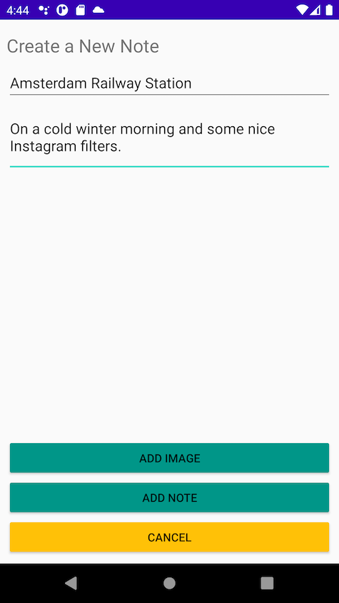
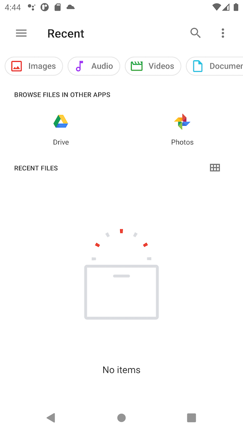
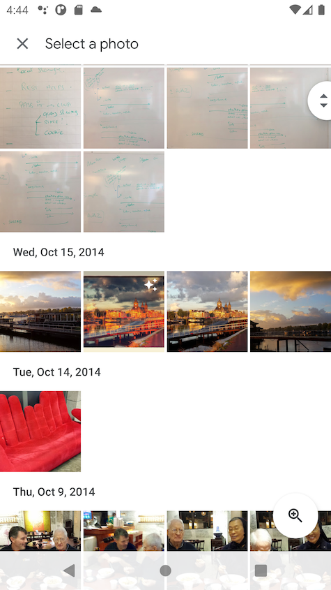
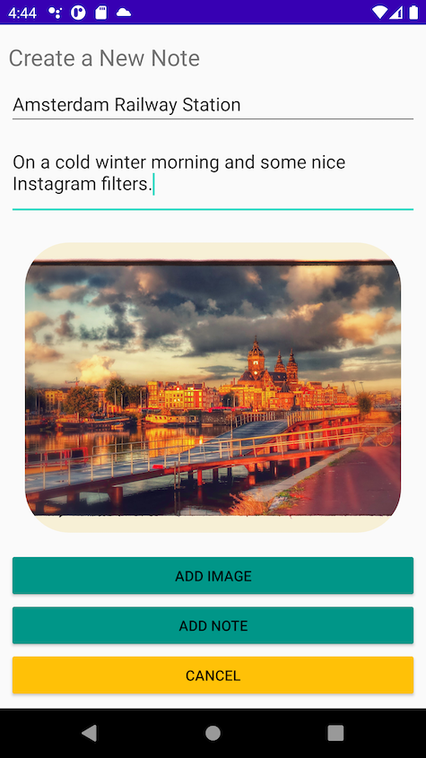
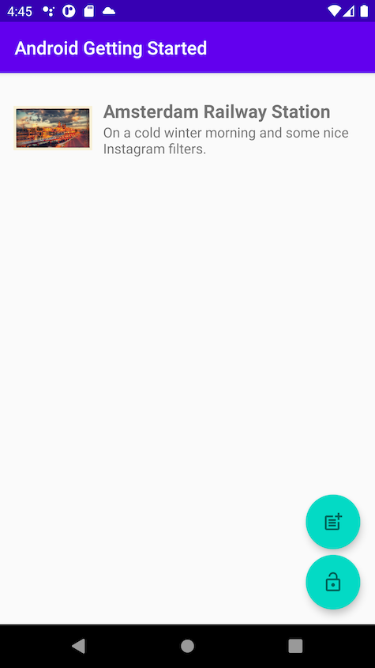

# Introduction

Now that we have the notes app working, let's add the ability to associate an image with each note. In this module, you will use the Amplify CLI and libraries to create a storage service leveraging [Amazon S3](https://aws.amazon.com/s3/). Finally, you will update the Android app to enable image uploading, fetching, and rendering.

## What You Will Learn

- Create a storage service
- Update your Android app - the logic to upload and download images
- Update your Android app - the user interface

## Key Concepts

Storage service - Storing and querying for files like images and videos is a common requirement for most applications. One option to do this is to Base64 encode the file and send as a string to save in the database. This comes with disadvantages like the encoded file being larger than the original binary, the operation being computationally expensive, and the added complexity around encoding and decoding properly. Another option is to have a storage service specifically built and optimized for file storage. Storage services like Amazon S3 exist to make this as easy, performant, and inexpensive as possible.

# Implementation

## Create the Storage Service

 To add image storage functionality, we'll use the Amplify storage category:

```zsh
amplify add storage
```

- *? Please select from one of the below mentioned services:*,accept the default **Content (Images, audio, video, etc.)** and press **enter**
- *? Please provide a friendly name for your resource that will be used to label this category in the project:* type **image** and press **enter**
- *? Please provide bucket name:, accept the default and press **enter**
- *? Who should have access:*, accept the default **Auth users only** and press **enter**
- *? What kind of access do you want for Authenticated users?* select all three options **create/update, read, delete** using the space and arrows keys, then press **enter**
- *? Do you want to add a Lambda Trigger for your S3 Bucket?*, accept the default **No** and press **enter**

After a while, you should see

```text
Successfully added resource image locally
```

## Deploy the Storage Service

To deploy the storage service we have just created, go to your terminal and **execute the command**:

``` zsh
amplify push
```

Press **Y** to confirm and, after a while, you should see:

```text
✔ Successfully pulled backend environment amplify from the cloud.
```

## Add Amplify Storage Libraries to the Android Studio Project

Before going to the code, add the following dependency to your app‘s `build.gradle` along with others you added before and click **Sync Now** when prompted:

```gradle
dependencies {
    implementation 'com.amplifyframework:aws-storage-s3:1.4.0'
}
```

## Initialize Amplify Storage plugin at runtime

Back to Android Studio, under `java/example.androidgettingstarted`, open `Backend.kit` and add a line in the Amplify initialization sequence in `initialize()` method. Complete code block should look like this:

```kotlin
try {
    Amplify.addPlugin(AWSCognitoAuthPlugin())
    Amplify.addPlugin(AWSApiPlugin())
    Amplify.addPlugin(AWSS3StoragePlugin())

    Amplify.configure(applicationContext)

    Log.i(TAG, "Initialized Amplify")
} catch (e: AmplifyException) {
    Log.e(TAG, "Could not initialize Amplify", e)
}
```

## Add Image CRUD methods to the `Backend` Class

Still in `Backend.kt`. Anywhere in the `Backend` class, **add** the the following three methods to upload, download and delete image from the Storage:

```kotlin
fun storeImage(filePath: String, key: String) {
    val file = File(filePath)
    val options = StorageUploadFileOptions.builder()
        .accessLevel(StorageAccessLevel.PRIVATE)
        .build()

    Amplify.Storage.uploadFile(
        key,
        file,
        options,
        { progress -> Log.i(TAG, "Fraction completed: ${progress.fractionCompleted}") },
        { result -> Log.i(TAG, "Successfully uploaded: " + result.key) },
        { error -> Log.e(TAG, "Upload failed", error) }
    )
}

fun deleteImage(key : String) {

    val options = StorageRemoveOptions.builder()
        .accessLevel(StorageAccessLevel.PRIVATE)
        .build()

    Amplify.Storage.remove(
        key,
        options,
        { result -> Log.i(TAG, "Successfully removed: " + result.key) },
        { error -> Log.e(TAG, "Remove failure", error) }
    )
}

fun retrieveImage(key: String, completed : (image: Bitmap) -> Unit) {
    val options = StorageDownloadFileOptions.builder()
        .accessLevel(StorageAccessLevel.PRIVATE)
        .build()

    val file = File.createTempFile("image", ".image")

    Amplify.Storage.downloadFile(
        key,
        file,
        options,
        { progress -> Log.i(TAG, "Fraction completed: ${progress.fractionCompleted}") },
        { result ->
            Log.i(TAG, "Successfully downloaded: ${result.file.name}")
            val imageStream = FileInputStream(file)
            val image = BitmapFactory.decodeStream(imageStream)
            completed(image)
        },
        { error -> Log.e(TAG, "Download Failure", error) }
    )
}
```

These three methods simply call their `Amplify` counterpart. Amplify storage has three file protection levels:

- **Public** Accessible by all users
- **Protected** Readable by all users, but only writable by the creating user
- **Private** Readable and writable only by the creating user

For this app, we want the images to only be available to the Note owner, we are using the `StorageAccessLevel.PRIVATE` property.

## Add UI Code to Capture an Image

Next step is to modify the UI to allow the user to select an image from the phone library when clicking the "Add image" button on the `AddNoteACtivity`.

Two changes are necessary: change the "Add Note" activity layout to add an "Add image" button and a image view, and add handler code in the activity class.

In Android Studio, under `res/layout`, open `AddNoteACtivity.kt` file and **add this Button** element just above the `addNote` button:

```xml
<!-- after the description EditText -->
<com.google.android.material.imageview.ShapeableImageView
    android:id="@+id/image"
    android:layout_width="match_parent"
    android:layout_height="280dp"
    android:layout_margin="16dp"
    android:scaleType="centerCrop" />

<!-- after the Space -->
<Button
    android:id="@+id/captureImage"
    style="?android:attr/buttonStyleSmall"
    android:layout_width="fill_parent"
    android:layout_height="wrap_content"
    android:layout_gravity="center_horizontal"
    android:backgroundTint="#009688"
    android:text="Add image" />
```

In Android Studio, under `java/example.androidgettingstarted`, open `AddNoteACtivity.kt` file and **add this code** in the `onCreate()` method:

```kotlin
// inside onCreate() 
// Set up the listener for add Image button
captureImage.setOnClickListener {
    val i = Intent(
        Intent.ACTION_GET_CONTENT,
        MediaStore.Images.Media.EXTERNAL_CONTENT_URI
    )
    startActivityForResult(i, SELECT_PHOTO)
}

// create rounded corners for the image
image.shapeAppearanceModel = image.shapeAppearanceModel
    .toBuilder()
    .setAllCorners(CornerFamily.ROUNDED, 150.0f)
    .build()
````

Add the required `import` on `Intent`, `MediaStore` and `CornerFamily`.

Also add this constant value in the companion object:

```kotlin
// add this to the companion object 
private const val SELECT_PHOTO = 100
```

Finally, add the code that receive and store the selected image to a temporary file.  

Add the below code anywhere in the `AddNoteACtivity`class :

```kotlin
//anywhere in the AddNoteActivity class

private var noteImagePath : String? = null
private var noteImage : Bitmap? = null

override fun onActivityResult(requestCode: Int, resultCode: Int, imageReturnedIntent: Intent?) {
    super.onActivityResult(requestCode, resultCode, imageReturnedIntent)
    Log.d(TAG, "Select photo activity result : $imageReturnedIntent")
    when (requestCode) {
        SELECT_PHOTO -> if (resultCode == RESULT_OK) {
            val selectedImageUri : Uri? = imageReturnedIntent!!.data

            // read the stream to fill in the preview
            var imageStream: InputStream? = contentResolver.openInputStream(selectedImageUri!!)
            val selectedImage = BitmapFactory.decodeStream(imageStream)
            val ivPreview: ImageView = findViewById<View>(R.id.image) as ImageView
            ivPreview.setImageBitmap(selectedImage)

            // store the image to not recreate the Bitmap every time
            this.noteImage = selectedImage

            // read the stream to store to a file
            imageStream = contentResolver.openInputStream(selectedImageUri)
            val tempFile = File.createTempFile("image", ".image")
            copyStreamToFile(imageStream!!, tempFile)

            // store the path to create a note
            this.noteImagePath = tempFile.absolutePath

            Log.d(TAG, "Selected image : ${tempFile.absolutePath}")
        }
    }
}

private fun copyStreamToFile(inputStream: InputStream, outputFile: File) {
    inputStream.use { input ->
        val outputStream = FileOutputStream(outputFile)
        outputStream.use { output ->
            val buffer = ByteArray(4 * 1024) // buffer size
            while (true) {
                val byteCount = input.read(buffer)
                if (byteCount < 0) break
                output.write(buffer, 0, byteCount)
            }
            output.flush()
            output.close()
        }
    }
}
```

The above code consumes the selected image as an InputStream, twice. The first `InputStream` creates a `Bitmap` image to display in the UI, the second `InputStream` saves a temporary file to send to the backend.

I chose to go through a temporary file because the Amplify API consumes `File`objects. I recognized this is not the most efficient design decision, but it made the code as simple as possible.

To verify everything works as expected, build the project. Click **Build** menu and select **Make Project** or, on Macs, type **&#8984;F9**. There should be no error.  

## Store image when Notes are created 

Let's invoke the storage methods from `Backend` when a `Note` is created.
Open `AddNoteActivity.kt` and **modify** the `addNote.setOnClickListener()` method, to add the below code after the `Note` object is created.

```kotlin
// add this in AddNoteACtivity.kt, inside the addNote.setOnClickListener() method and after the Note() object is created.
if (this.noteImagePath != null) {
    note.imageName = UUID.randomUUID().toString()
    //note.setImage(this.noteImage)
    note.image = this.noteImage

    // asynchronously store the image (and assume it will work)
    Backend.storeImage(this.noteImagePath!!, note.imageName!!)
}
```

## Load image when Notes are loaded

To load images, we modify the static `from` method on the `Note` data class.  That way, every time a `NoteData` object returned by the API is converted to a `Note` object, the image is loaded in parallel. When the image is loaded, we notify the LiveData's `UserData` to let observers known about the change. This triggers an UI refresh.

Open `UserData.kt` and **modify** the `Note` data class' companion object like this:

```kotlin
// static function to create a Note from a NoteData API object
companion object {
    fun from(noteData : NoteData) : Note {
        val result = Note(noteData.id, noteData.name, noteData.description, noteData.image)
        
        if (noteData.image != null) {
            Backend.retrieveImage(noteData.image!!) {
                result.image = it

                // force a UI update
                with(UserData) { notifyObserver() }
            }
        }
        return result
    }
}
```

## Delete images when Notes are deleted 

The last step is to clean up after ourselves, i.e. to delete images from the cloud storage when a user deletes a Note. If you don't do it to save storage space, do it for your AWS bills as Amazon S3 charges per Gb/month of data stored (the first 5Gb are for free, you will not be charged to run this tutorial).

Open `SwipeCallback.kt` and add the code below at the end of `onSwipe()` method:

```kotlin
if (note?.imageName != null) {
    //asynchronously delete the image (and assume it will work)
    Backend.deleteImage(note.imageName!!)
}
```

## Build and Test

To verify everything works as expected, build and run the project.Click **Run** icon ▶️ in the toolbar or type **^ R**. There should be no error.

Assuming you are still signed in, the app starts on the list of Note you did not delete from the previous section.  Use the `Add Note` button again to create a Note. This time, add a picture selected from the local image store.

Quit the app and restart it to verify that the image is correctly loaded.

Here is the complete flow.

| Create a Note | Pick Image 1 | Pick Image 2 | Create Note |Note with Image
| --- | --- | -- | -- | -- | 
|  |  |  |  | 

## Congratulations 🥁🏆🎊🎉🎈 !

You have build an Android application using AWS Amplify! You have added authentication to your app allowing users to sign up, sign in, and manage their account. The app also has a scalable GraphQL API configured with an Amazon DynamoDB database allowing users to create and delete notes. You have also added file storage using Amazon S3 allowing users to upload images and view them in their app.

In the last section, you will find instructions to reuse or to delete the backend we just created.

[Next](/07_cleanup.md) : Cleanup.